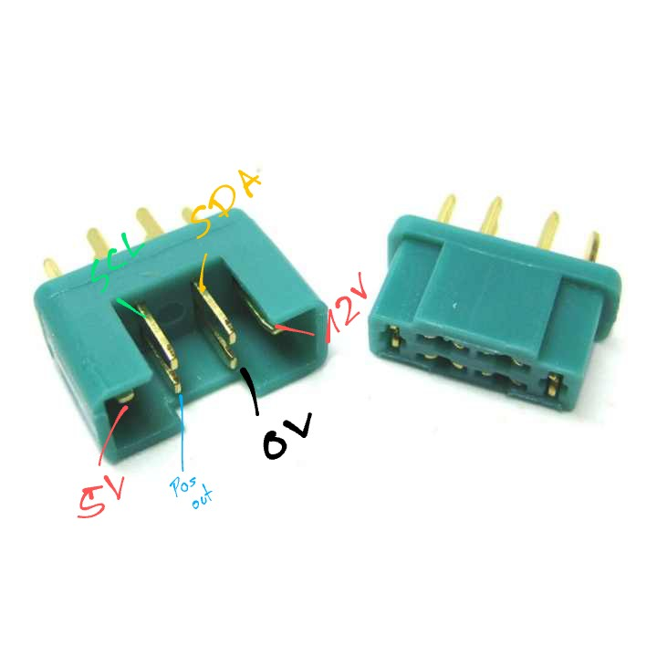
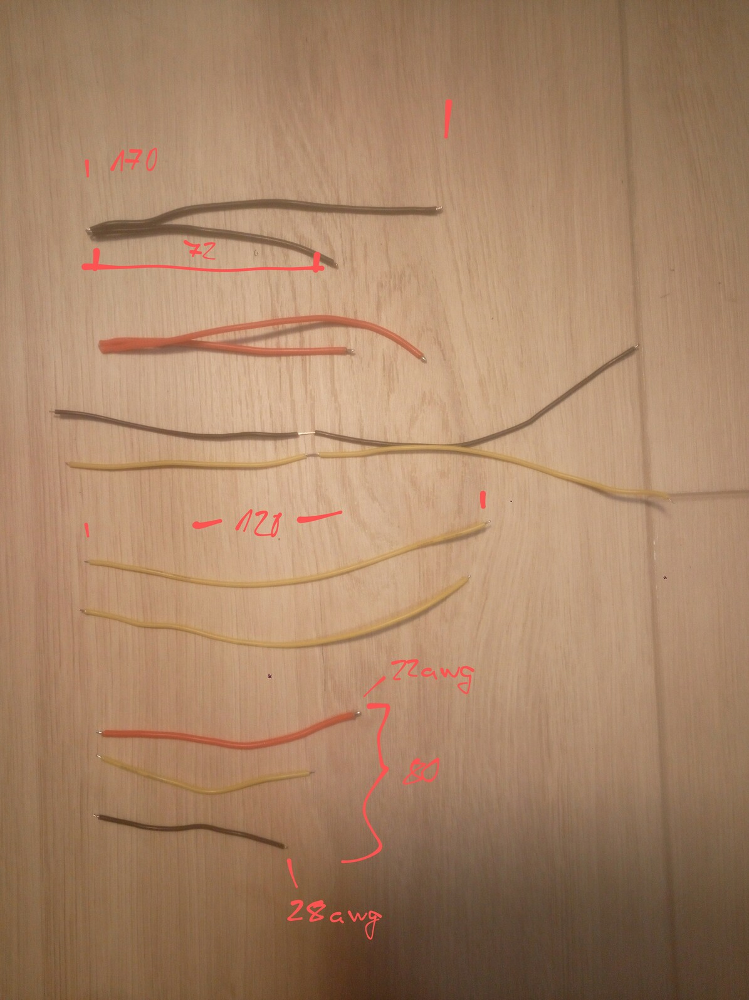

# OpenHorseFeeder

  
  

In general OpenHorseFeeder works by putting one portion of hay onto a floor
which is then released with an electric lock. It mostly depends on the size of
your cabin how many floors you can put in there.
For this one main module based on a Raspberry Pi Zero is used. Each electric
lock is then controlled by an Arduino Pro Mini which opens the lock and reports
the locks status to the main module with I2C.

Electrics
=========
The main module uses an external 12V power supply. This will be used to drive
the 12V electric locks. For the Raspberry Pi and Arduinos a step-down converter
to 5V is build into the main module.

Parts needeed
=============

- 1x Raspberry Pi Zero W
- Network cable for module connection (or any other cable with at least 6 wires)
- [1x 12V power supply with barrel connector](https://www.amazon.de/-/en/LED-Power-Supply-12-24/dp/B07FNMKTBL/ref=sxin_13_b2b_sx_ftd_qd)
- [1x 5v-3.3V level shifter](https://www.amazon.de/RUNCCI-YUN-4-Channel-Converter-Bidirectional-Microcontroller/dp/B082F6BSB5/ref=sr_1_2_sspa)
- [1x XL4015 Step-Down](https://www.amazon.de/-/en/XL4015-Converter-Module-1-25-36V-Adjustable/dp/B07XRF9NWP/ref=sr_1_6)
- [2 pairs per module: Multiplex connectors per module](https://www.amazon.de/10-Pairs-20-Pieces-Multiplex-Compatible-Trading/dp/B00ON2EXL8/ref=sr_1_2_sspa)
- [1 per module: Arduino Pro Mini](https://www.amazon.de/-/en/AZDelivery-PRO-Mini-ATmega328-16MHz/dp/B07VKLCYFV/ref=sr_1_3)
- [1 per module: IRFZ44N MOSFET](https://www.amazon.de/Youmile-Transistor-N-Channel-International-Rectifier/dp/B07QGNBJDF/ref=sr_1_3_sspa)
- [1 per module: electric lock](https://www.amazon.de/-/en/Electric-Electromagnetic-Locking-Cabinet-Emergency/dp/B07KWMH16C/ref=sr_1_9)

Wiring
======

Modules Connectors
------------------
The connector cables are simply wired in parallel with a male input and a male
output connector. Therefore the modules have a female input and female output
connector. Because of the parallel wired connector cable the pinout for the
input and output connectors on the modules are mirrored.

Incoming                    |Outgoing
:--------------------------:|:---------------------------:
 | 

main module
-----------

The Raspberry Pi uses 3.3V level for I2C and the Arduino uses 5V, therefore a
level shifter is needed to fix this.

Floor Module
=============

The electric lock has a sensor which triggers when the hook is opened. This is
a simple switch connected to the green and white wire.

Also the module uses the serial interface to find it's position.
During initialization, the module will start at position 0 and print that on TX.
If the next modules recieves something on RX, it will increment that by one and
also write that to TX.
That way each module in the string can find out it's position with the first one
having the lowest position.

Wiring
------

Arduino pin|part
:---------:|:-------------:
10         |IFRZ44N Gate
2          |lock white wire (switch)
RX         |pos in
TX         |pos out
SCL        |SCL
SDA        |SDA

Image                       |Wiring diagram
:--------------------------:|:---------------------------:
  | 

Wire lengths for mass production
--------------------------------

As long as there is no PCB for this modules, here is a list of all wires for
quick preparation:

Size (AWG)|Color |Total Length|Middle stripped part
:--------:|:----:|:----------:|:------------------:
22        |Red   |80mm        |-
22        |Red   |170mm       |72mm
22        |Black |170mm       |72mm
28        |Yellow|170mm       |72mm
28        |Black |170mm       |72mm
28        |Yellow|120mm       |-
28        |Yellow|120mm       |-
28        |Yellow|80mm        |-
28        |Black |80mm        |-

Flashing
--------

Nothing special here, just flash the code to the Pro Mini using your favourite
method (i.e. Arduino IDE). To do his connect the device's serial with your pc
with an USB-TTL converter. When you hit the upload button in the Arduino IDE and
it says "uploading..." in the log box at the bottom, you need to hit the reset
button real quick to make it work.

Make sure your module isn't connected to any already flashed module, as this
pollutes the serial communication.

After flashing you should be able to put the module into any location, as it
finds it's position in the string automatically.
